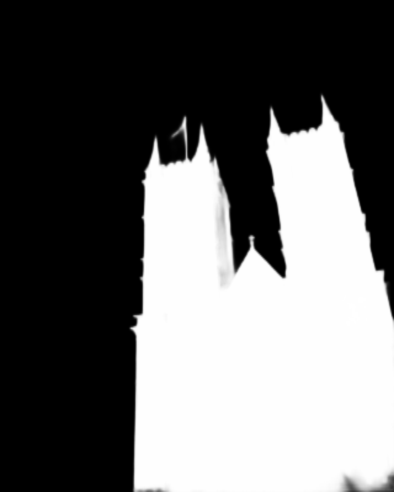
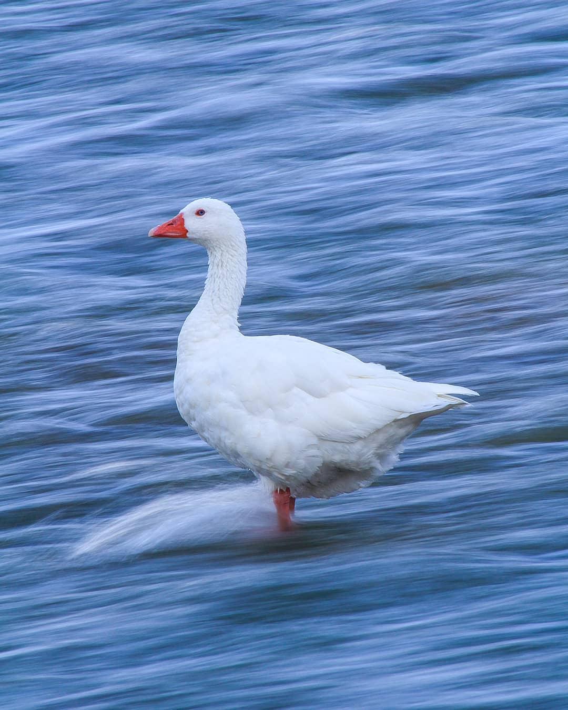
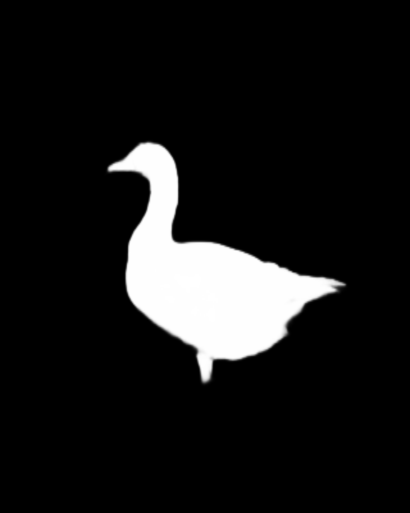
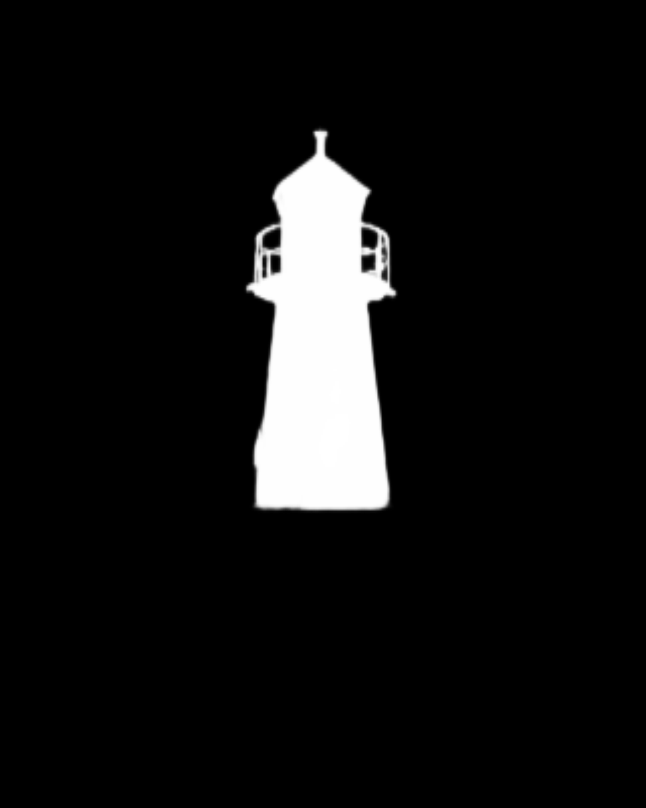
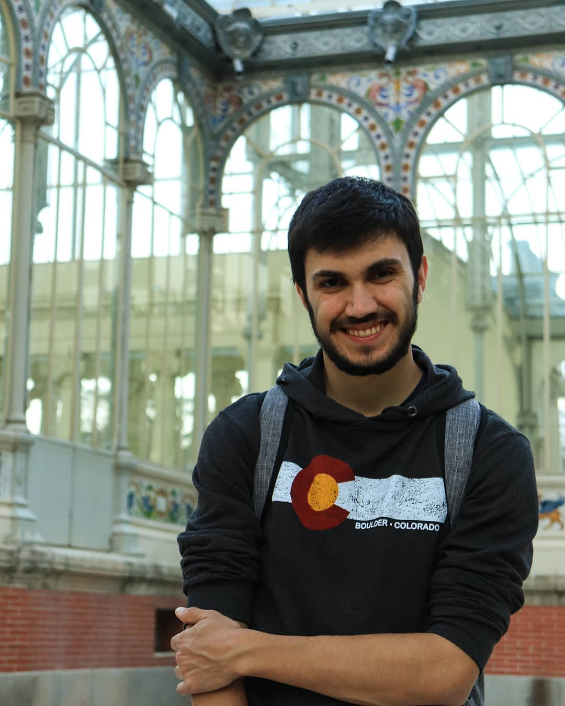
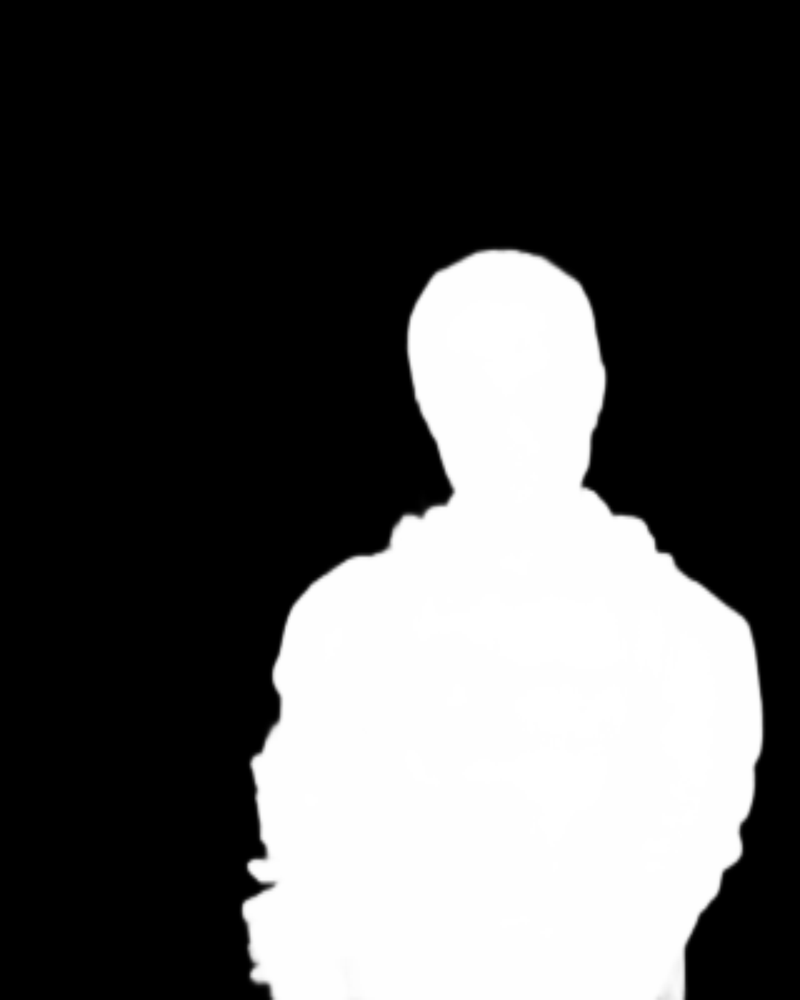
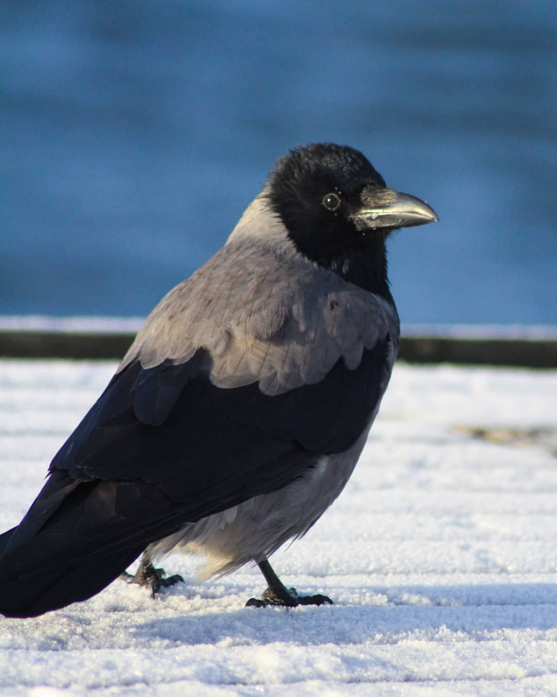
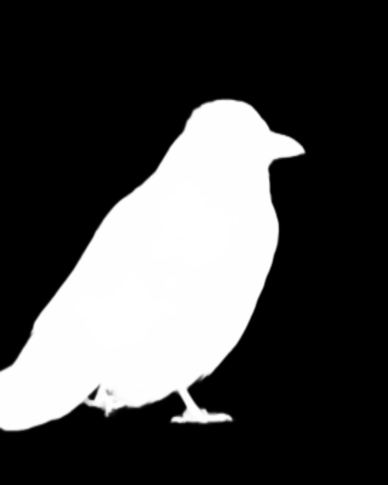

# U^2-Net

[](http://hits.dwyl.io/AlbertSuarez/u-2-net)

[](https://GitHub.com/AlbertSuarez/u-2-net/stargazers/)
[](https://GitHub.com/AlbertSuarez/u-2-net/network/)
[](https://github.com/AlbertSuarez/u-2-net)
[](https://GitHub.com/AlbertSuarez/u-2-net/graphs/contributors/)
[](https://github.com/AlbertSuarez/u-2-net/blob/master/LICENSE)

✂️ Simplified version of U^2-Net for testing purposes

## Motivation

This repository came up after seeing the amazing work that the [University of Alberta](https://www.ualberta.ca/index.html) did with the [U^2-Net](https://github.com/NathanUA/U-2-Net) model for Salient Object detection. I wanted to understand how it actually works and build a easier script for running inference in one or several images to make this more accessible to the community.

## Examples

<p align="center">
  
  
</p>

<p align="center">
  
  
</p>

<p align="center">
  
  
</p>

<p align="center">
  
  
</p>

<p align="center">
  
  
</p>

<br>

## Python requirements

This project is using Python3.7. All these requirements have been specified in the `requirements.lock` file.

1. [numpy](https://numpy.org/) 1.15.2
2. [scikit-image](https://scikit-image.org/) 0.14.0
3. [Pillow](https://pillow.readthedocs.io/en/stable/) 5.2.0
4. [torch](https://github.com/pytorch/pytorch) 0.4.1
5. [torchvision](https://pytorch.org/docs/stable/torchvision/index.html) 0.2.1

## Environment

To create your environment and testing your own images, you must follow the next scripts:

1. Pull models from Git LFS

   ```bash
   git lfs fetch --all
   ```

2. Create a virutalenv, where a usage of [virtualenv](https://realpython.com/blog/python/python-virtual-environments-a-primer/) is recommended for package library / runtime isolation.

   ```bash
   python -m pip install --user virtualenv
   python3 -m virtualenv --python=/usr/bin/python3 /opt/venv
   source /opt/venv/bin/activate
   ```

3. Install dependencies

   ```bash
   pip3 install -r requirements.lock
   ```

## Usage

There are two ways of testing this out. Using Python, after building the enviornment mentioned above, or using the Docker image provided.

### Python

Simple as running the following script:

```bash
python3 -m src.run INPUT_PATH OUTPUT_PATH [--model MODEL] [--gpu] [--show_user_warnings]
```

- **INPUT_PATH**: existing path pointing to a single image or a folder containing several images to process.
- **OUTPUT_PATH**: path to a folder where put the generated images.
- **MODEL**: model to be used for running inference, which could be *u2net* (default) or *u2netp* (a smaller version).
- **GPU**: if this parameter is enabled, the script will try to find CUDA 8 installed for running use GPU accelaration.
- **SHOW_USER_WARNINGS**: if this parameter is enabled, user warnings will be showed during the execution.

### Docker

TODO

## Merits

Again, kudos to [Xuebin Qin](https://webdocs.cs.ualberta.ca/~xuebin/), [Zichen Zhang](https://webdocs.cs.ualberta.ca/~zichen2/), [Chenyang Huang](https://chenyangh.com/), [Masood Dehghan](https://sites.google.com/view/masooddehghan), [Osmar R. Zaiane](http://webdocs.cs.ualberta.ca/~zaiane/) and [Martin Jagersand](https://webdocs.cs.ualberta.ca/~jag/) for this amazing model that they came up.

